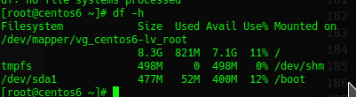
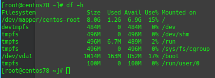
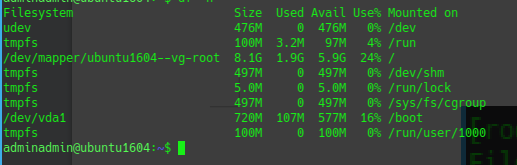
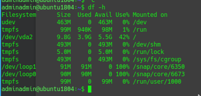
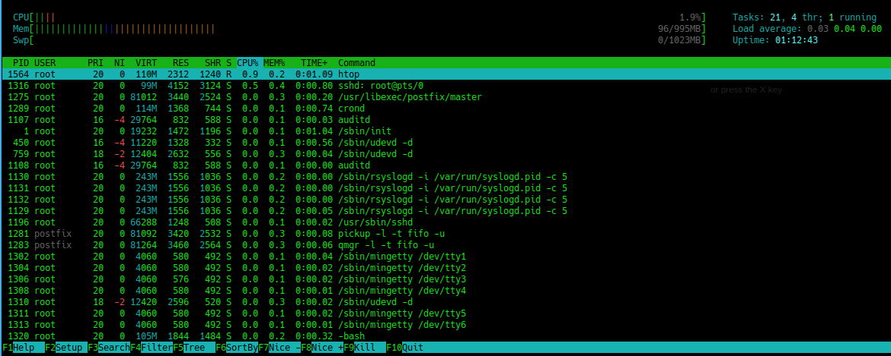
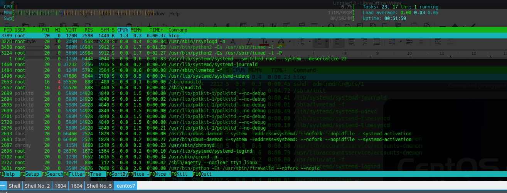
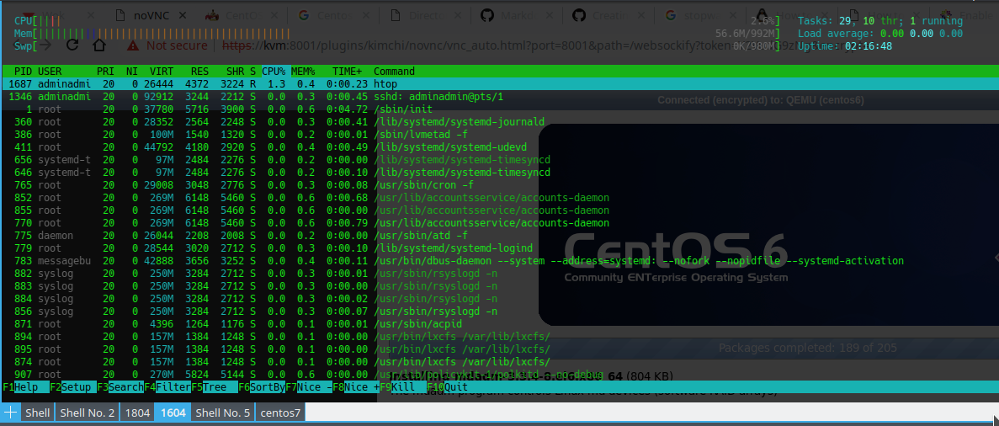
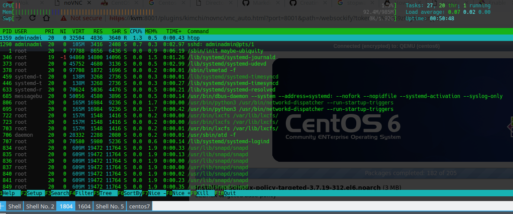

# Centos vs Ubuntu

So for a long time I have alway wonder what Linux Server distribution i should chose to us. I started with Centos 6 back in 2011 as this was the linux server i was looking after at work. I then found about Ubuntu, as this my Ubuntu Desktop distribution for my daily linux driver, Ubuntu seems a good choice. I currently have one Centos 6 box running my mail server and a Ubuntu server running on a VPS for my various website. 

So i want to see what the main different where between Centos and Ubuntu are and which server i should focus on. I want this guide as refence so that if i had to configure a server i had something to refer to.

I setup a KVM box and install the following VM with the following Server distribution:Centos 6,7 and Ubuntu 16.04 LTS and 18.04 LTS. Each 1 vCPU 1GB Ram,10GB HD.


## Installation

What is involved of setting a distribution up:

### Centos 6

1. Media check.
2. Language Selection.
3. Keyboard setup. 
4. Finds the disk and will format/partition for you. 
5. Set hostname and Configure network*.
6. Select time zone.
7. Set root password.
8. Chose Install Type - Default is replace existing file system
10. The Installs finish off by installing Packages.

Time to Install:17 mins

*Remember carefully not to miss the "configure network" box in the bottom right hand corner and remember to select "connect to network automatically". If not when you boot you will not get any network access

### Centos 7

1. Menu to check if you want to install centos 7
2. Language Selection.
3. Installation Summary, Chose which Hard disk to use and configure network settings. 
4. The install then begins and you then get presented to set the root password and create a user account is required, while the install is happening
5. Set hostname and Configure network*.
6. Select time zone.
7. Set root password.
8. Chose Install Type - Default is replace existing file system
10. The Installs finish off by installing Packages.

Time to Install:62 mins.

This is install on about 20 Mins, but then takes ages to Post-Install task (42 Mins). This is a known bug installing centos 7 on KVM VM.

https://bugs.centos.org/view.php?id=14980#bugnotes

### Ubuntu 16.04 LTS

1. Language Selection.
2. Menu to chose to install Ubuntu 16.04
3. Select Keyboard layout.
4. Configure hostname.
5. Create User and Password.
6. Decide if you would like to encrypt the home partition.
7. Set Time Zone
8. Enter Prxoy server address if requird.
10. Select if you like to install updates automatically.
11. Select what packages to install. I chose SSH Server.

Time to Install:28 mins.

### Ubuntu 18.04 LTS

1. Language Selection.
2. Menu to chose to install Ubuntu 16.04
3. Select Keyboard layout.
4. Configure IP settings.
5. Enter Proxy server address if required. 
6. Select mirror for extra software.
7. Partition the disk (Default option: Guided use entire disk and don't use LVM)
8. Create User and Password.
9. Decide if you would like to encrypt the home partition.
10. Create User and Password.
11. Select what packages to install. I chose SSH Server.

Time to Install:24 mins.

## Configure Network

In the installs above I configure the server to get their IP address using DHCP, I now want to know how easier it is to configure a static IP address on the server.

### Centos 6

To see current NIC and IP address settings:
```
ifconfig 
```
IP Config file is found in:
```
/etc/sysconfig/network-scripts/ifcfg-eth0 
```
Add the following details to configure static IP address:
```
IPADDR=192.168.127.80
SUBNET=24
GATEWAY=192.168.127.1
```

To restart network:

```
service network restart 
```

To set the hostname edit the following files and reboot the host: 
```
/etc/sysconfig/network

```
and
```
/etc/hosts
```
To edit DNS settings edit the following file: 
```
/etc/resolv.conf
```

### Centos 7

To see current NIC and IP address settings
```
ip address
```
Type ```nmtui``` command in your terminal to open network manager to configure thr ip settings . This can configure IP settings and Hostname.

Use the followinf to apply settings.

```
systemctl restart network
```

Again Network settings located in this file:

```
/etc/sysconfig/network-scripts/ifcfg-eth0 
```

### Ubuntu 16.04 LTS

Edit the following file:
```
/etc/network/interfaces
```
Delete the following:
```
iface ens32 inet dhcp
```
add the following:
```
auto ens32
iface ens32 inet static 
address 192.168.127.19
netmask 255.255.255.0 
gateway 192.168.127.1
dns-search domain.local
dns-nameservers 192.168.127.10
```
restart network
```
sudo ifdown ens32 && sudo ifup ens32
```
or
```
systemctl restart networking.service
```

### Ubuntu 18.04 LTS

Ubuntu 18.04 uses netplan to config network interfaces. 

Edit the following file:
```
/etc/netplan/50-cloud-init.yaml
```
and change to the following:

```
network:
    version: 2
    ethernets:
        enp0s25:
            dhcp4: no
            addresses: [192.168.127.200/24]
            gateway4: 192.168.127.10
            nameservers:
                addresses: [192.168.127.10]
```

Run the following command to apply the config
```
sudo netplan --debug  apply
```

## Configure Updates

After the base install we needed to update the system. 

### Centos 6
Update Cmd: 
``` yum -y update ```

20 Packages to upgrade: 89MB

Time to install the upgrades: 7 mins


### Centos 7
Update Cmd: 
``` yum -y update ```

63 Packages to upgrade: 129MB

Time to install the upgrades: 12 mins

### Ubuntu 16.04 LTS
Update Cmd: 
``` sudo apt update ``` and ``` sudo apt install``` 

39 Packages to upgrade: 15MB

Time to install the upgrades: 7 mins

### Ubuntu 18.04 LTS

Update Cmd: 
``` sudo apt update ``` and ``` sudo apt install``` 

78 Packages to upgrade: 30MB

Time to install the upgrades: 13 mins


## Configure SSH

The next thing i do after install is configure SSH so i can remote in to the server.

### Centos 6 and 7
The SSH server is already installed and started, but cant login in with root account and password. I know this is unsafe but is ok for this test. So i enable root login and password authentication via ssh:

Edit the following file
```
/etc/ssh/sshd_config
```
Commented out the following lines:
```
PermitRootLogin = yes
PasswordAuthentication yes
```
restart the sshd Service 
```
service sshd restart
```

### Ubuntu 16.04 and 18.04 LTS

I enabled this as part of the setup. So do not need to configure it here.

## Hard Drive Layout
All distribution expect Ubuntu 18.04 seem to be using LVM as a logical volume management, If you decide to chose the defaults partition options in the installer.

The following commands all seem to work in all four Distributions

```
df -h
cat /etc/fstab 
lvdisplay
pvdisplay
lvmdiskscan
fdisk -l
```

### Centos 6

### Centos 7

### Ubuntu 16.04 LTS

### Ubuntu 18.04 LTS


## System Performance and Daemon process
All Distributions using systemd expect Centos 6 which is using init.d as in control system.

All 4 distributions seems that you can use the following commands to stop and  start services
```
service httpd start|stop|restart
```
On the systemd distribution this seem to shortcut to the systemctl cmd which is used to control services in systemd.

To enable services on start up. In Centos 6 you can use:
```
chkconfig httpd on
```

For Centos 7, Ubuntu 16.04 and 18.04 Use the following systemctl cmd:
```
systemctl enable httpd
```

Below is htop output of the system loads of each system when the system is idle.
### Centos 6

### Centos 7

### Ubuntu 16.04 LTS

### Ubuntu 18.04 LTS


## Firewalls

### Centos 6
By Default this is IP tables and it is enable by default. Use the following command to see the current firewall rules

```
iptables --line -vnL
``` 
The default rules allow outbound traffic to be allowed and all inbound traffic is block expect port 22, which allows SSH connections in.

To disable firewall:
```
service iptables stop
```

To allow port 80:
```
iptables -I INPUT 5 -i eth0 -p tcp --dport 80 -m state --state NEW,ESTABLISHED -j ACCEPT
```
To commit changes:
```
service iptables save
service iptables restart
```
### Centos 7

By default Centos 7 uses firewalld and is enable by default and allow traffic outbound and inbound port 22.

To disable firewall:
```
systemctl stop firewalld
```

More info to follow...
### Ubuntu 16.04 and 18.04 LTS
Ubuntu use UFW (Uncomplicated Firewall) by default and is disable by default.

To view status of UFW:
```
sudo ufw status verbose
```

## Stopping and Rebooting the distribution

All system seem to use the same following commands:

```
restart
shutdown now
```
Centos 6, you seem to have to use:
```
shutdown now -h
```
If not it puts the server into single user mode and will not power off.
## Logs

The default log locations to seem to be the same on all distribution
```
\var\log
```
```dmesg``` work all distribution as well

## User, File and Folder Permissions

The follow commands all work on all 4 distribution.
```
adduser
groupadd
usermod
chown
mkdir
```
# Kernel Verison
| Distribution       | Kernel Version       
| ------------- |-------------| 
| Centos 6    |2.6.32-754.12.1.el6.x86_64| 
| Centos 7      | 3.10.0-957.10.1.el7.x86_64     | 
| Ubuntu 16.04 LTS | 4.4.0-145-generic    | 
| Ubuntu 18.04 LTS | 4.15.0-47-generic      | 
## Webserver,Samba and Mysql

I installed the following services and want to see where the config files are located and the verison of the software installed.
#### Apache

The packages is called httpd on Centos and apache2.

Config file: /etc/httpd/conf/httpd.conf (All Distributions)
Default Website Files: /var/www/html (All Distributions)

| Distribution       | Apache Version      
| ------------- |-------------| 
| Centos 6    |2.4.18| 
| Centos 7      | 2.4.29    | 
| Ubuntu 16.04 LTS | 4.4.0-145-generic    | 
| Ubuntu 18.04 LTS | 4.15.0-47-generic   |
   | 
#### Nginx
Config file: /etc/nginx/nginx.conf (All Distributions)
Config file: /etc/nginx/conf.d/default.conf (centos 6 also use this config files)
Default Website Files:
/usr/share/nginx/html (All Distributions)

| Distribution       | Nginx Version      
| ------------- |-------------| 
| Centos 6    |1.10.2| 
| Centos 7      | 1.12.2    | 
| Ubuntu 16.04 LTS | 1.10.3   | 
| Ubuntu 18.04 LTS | 1.14.0  |

sitesenable block

#### Mysql
All Distributions are using mysql expect centos 7 which is using MariaDB 

 Distribution       | Version  | Variant |     
| ------------- |-------------| ----|
| Centos 6    |5.1.73-8.el6_8| mysql |
| Centos 7      | 1:5.5.60-1.el7_5     | MariaDB |
| Ubuntu 16.04 LTS | 5.7.25  | mysql |
| Ubuntu 18.04 LTS | 5.7.25 | mysql |

#### Samba
Config file: /etc/nginx/nginx.conf (All Distributions)

| Distribution       | Samba Version      
| ------------- |-------------| 
| Centos 6    |3.6.23-51.el6| 
| Centos 7      |4.8.3-4.el7| 
| Ubuntu 16.04 LTS | 4.3.11 | 
| Ubuntu 18.04 LTS | 4.7.6 |


## Conclusion

So after all this discovery work the different between centos and ubuntu  are quite small. Each just distribution has it own little way of doing things. Like how to set IP network settings and how to update the system. But all the other main linux  commands you will use on the system like moving files about, list dirs, greping all use the same commands.

So I am a lot happier now that i have done this little project and have learnt that it does not really mater what linux distribution you chose to focus on, you should still be able to find your self around different linux distribution.

The main thing I also noticed and have read online is that Centos/Redhat is designed for a corporate environment where Ubuntu is design for fast moving, up and coming cloud internet company. With Centos you are given 10 years of security updates. Where Ubuntu release a LTS every two years and this is support for 5 years. But you can pay for a extra 5 years security updates.

I notice that Centos did not have things like wget installed out of the  box and that it had the minimal version of vim installed so thing like colour syntax does work when editing config files.

The other thing with centos has by default is SELinux enabled. Which give you as extra lay of security. But most people disable it if they cant get their application working. 

In ubuntu the root account is disabled and you have to setup user accounts and then use sudo to run commands as root. This is configured out of the box, where compared to Centos out of the box you have to use the root account and you have to add users and setup sudo.

So to me I am like Ubuntu server more then Centos and think this is what I am going to focus on. I am really impressed with 18.04 edition and like the install. But i will keeping a eye on Centos as i still need to look after a couple of these boxes.


